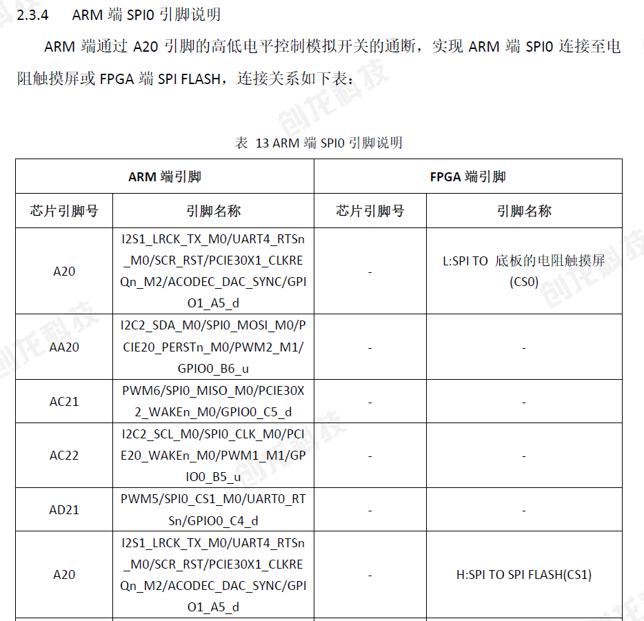
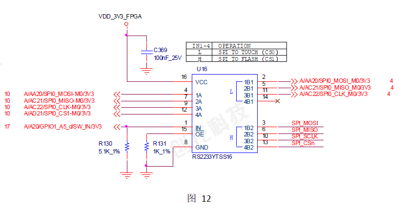

# arm控制fpga更新固件

```bash
usage:./flash_fpga.sh dram_pcie2025082802.sfc

F:\中元华电\TL3568F-EVM_V1.2\5-硬件资料\核心板资料\SOM-TL3568F工业核心板硬件说明书.pdf
2.3章节有相关引脚说明

脚本文件新增 msleep 定义，系统新增flashcp使用其库为mtd-utils

直接插入驱动ko无法使用，需要对SPI OE引脚设置
```

